<!-- ─────────────────────────────  HEADER  ───────────────────────────── -->

  

    

  
  
  
  
  

<!-- ─────────────────────────────  INTRO  ────────────────────────────── -->

## Hi, I'm Ashutosh 👋 — I turn messy problems into working solutions.

> I'm a **CS undergrad at BMSIT&M, Bengaluru**, building full-stack products and GenAI systems that hold up in the real world. I like problems where the data is messy, the assumptions break, and careful engineering actually matters — from multi-LLM code-review pipelines to campus placement platforms serving real users. Aiming for **SDE / AI-Engineering roles and research-oriented internships**.

 

## 🎯 Current Focus

- 🧠 Building **end-to-end GenAI systems** — multi-LLM orchestration, RAG, and agentic pipelines
- 🏗️ Shipping **full-stack TypeScript platforms** with clean architecture and honest evaluation
- ⚡ Sharpening **DSA & problem-solving** in C++ (900+ on LeetCode)
- 🔬 Understanding *why* systems work, not just how to wire them together

 

<!-- ─────────────────────────────  STACK  ────────────────────────────── -->

## 🛠️ Tech Stack

**Languages**

**Frontend & Backend**

**Databases & Infra**

**AI / ML & Web3**

**Tools**

 

<!-- ────────────────────────────  PROJECTS  ──────────────────────────── -->

## 🚀 Featured Projects

<table>
<tr>
<td width="50%" valign="top">

### 🔍 LGTM
**AI Code Review & Repo-Health Intelligence**

Parses repos with **Tree-sitter AST (12 languages)**, ranks files via a **PageRank graph** to compress whole-repo context into a 4K-token map, and runs a **multi-LLM layer** (Anthropic · OpenAI · Gemini) with per-key pooling, retries and BYOK isolation. Multi-agent indexing over **BullMQ/Redis** with Socket.io live progress and 20 REST APIs.

`React` `Node.js` `MongoDB` `Redis` `BullMQ` `Tree-sitter`

</td>
<td width="50%" valign="top">

### 🎓 PrepNext
**All-in-One Campus Placement Prep Platform**

Full-stack TypeScript platform (React SPA + serverless Express on Vercel) spanning **20+ feature routes**, unifying 85+ recruiters, 82+ verified PYQs and 150 DSA problems. **18-table** Prisma/PostgreSQL schema on Supabase with per-user isolation, **Google OAuth** + server-verified JWTs, and a WCAG-minded dark/light UI.

`React` `TypeScript` `Express` `Prisma` `PostgreSQL` `Supabase`

</td>
</tr>
<tr>
<td width="50%" valign="top">

### 🌾 AgriSmart
**Full-Stack Crop-Advisory Web App**

Generates tailored recommendations from **location, season and soil quality** with real-time weather alerts. Ships a **multilingual chatbot** (speech-to-text + voice out across 45+ languages) and **ML crop-disease detection** (CNN, 38 classes) returning diagnosis + treatment from a single leaf image.

`Full-Stack` `TensorFlow` `CNN` `Multilingual AI`

</td>
<td width="50%" valign="top">

### ⌚ CardioGuard
**watchOS SOS & Cardiac-Arrest Detection**

A **watchOS/Swift** app streaming live heart-rate, SpO₂ and motion from Apple Watch to detect probable cardiac arrest in real time — with **tiered SOS escalation** that alerts the nearest hospital + emergency contact and plays audio CPR instructions so bystanders can assist.

`Swift` `watchOS` `HealthKit` `Real-time`

</td>
</tr>
</table>

 

<!-- ────────────────────────────  STATS  ─────────────────────────────── -->

## 📊 GitHub Stats

  
  

   

  

    

  

 

<!-- ──────────────────────────  ACHIEVEMENTS  ─────────────────────────── -->

## 🏆 Achievements

- 🥈 **1st Runner-Up** — Aayam Hackathon, Newton College of Engineering (2026)
- 🏅 **Top 5 Team** — Build for Bangalore Hackathon (2026)
- 🥇 **IoT Track Winner** — NMIT Hacks, NMIT Bengaluru (2025)
- 🥇 **1st Prize** — 10-Day Hackathon, GenAI Club, BMSIT&M (2025)
- 🥈 **2nd Prize** — RVCE Hackathon, RV College of Engineering (2025)
- 🥈 **2nd Prize** — E-Cell Hackathon, BMSIT&M (2025)
- 🏆 **Best 2nd-Year Team** — Kalarava Coding Competition, BMSIT&M (2025)
- 💯 **900+ problems** solved on LeetCode

 

<!-- ─────────────────────────  SNAKE + FOOTER  ───────────────────────── -->

## 🐍 Contribution Graph

  <picture>
    <source media="(prefers-color-scheme: dark)" srcset="https://raw.githubusercontent.com/ashutoshsharma1309/ashutoshsharma1309/output/github-contribution-grid-snake-dark.svg" />
    <source media="(prefers-color-scheme: light)" srcset="https://raw.githubusercontent.com/ashutoshsharma1309/ashutoshsharma1309/output/github-contribution-grid-snake.svg" />
    
  </picture>

 

### 💬 Let's build something

<code>ashutosh@dev ~> exit 0</code>

